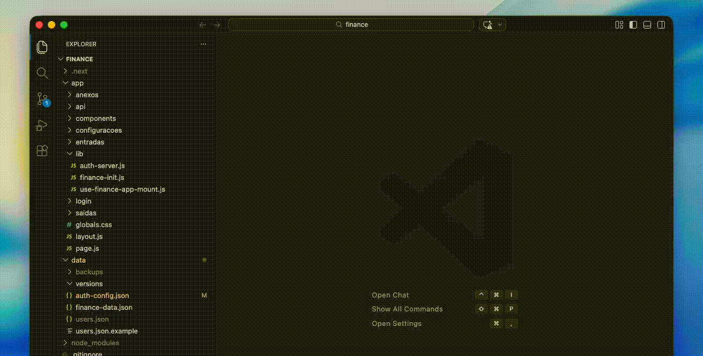

# Focus Folder Explorer

Work on a single folder in VS Code without changing your real workspace.

Focus Folder Explorer opens a dedicated, visual-only tree for the folder you care about right now. Your workspace root stays the same, so indexing, language servers, SFTP mappings, Git context, and other extensions keep working normally.

## Why use it

When a project is too noisy, you often want to focus on `app`, `src`, `modules`, or any deep subfolder.

The problem is that changing the workspace root or hiding files globally can break other tools.

Focus Folder Explorer solves that by showing a clean folder-only view without rewriting your workspace.

## How to use

1. Right-click any folder in the Explorer
2. Click `Focus on This Folder`
3. Open the `Focus Folder` view in the Activity Bar
4. Browse only that folder's files and subfolders
5. Click `Clear Focus` when you want the normal view again

## What stays untouched

- Workspace root
- File indexing
- Language servers
- Git context
- SFTP and other extension mappings
- Your existing `files.exclude` settings

## Good fit for

- Large monorepos
- Legacy projects with deep folder trees
- Backend folders inside bigger repositories
- Feature-folder workflows
- Cases where you want less visual noise without changing project behavior

## Commands

- `Focus on This Folder`
- `Clear Focus`
- `Reveal in Explorer`

## Notes

- The focused tree is visual-only
- It does not replace the built-in Explorer
- It respects your existing hidden-file rules from `files.exclude`
